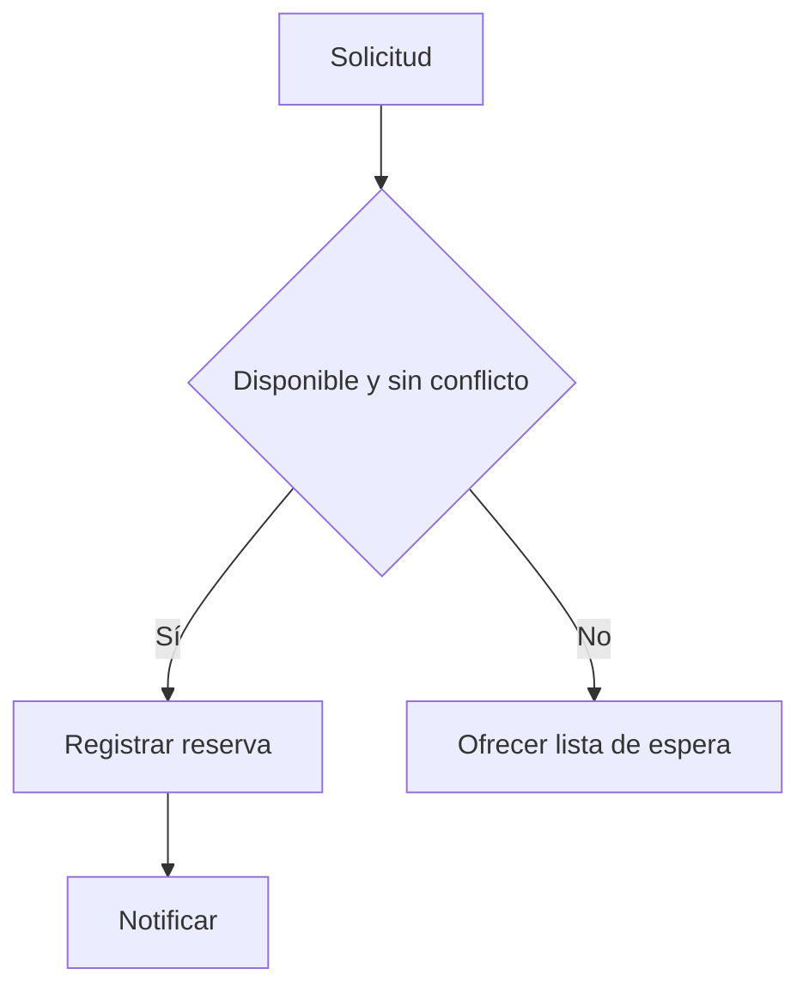
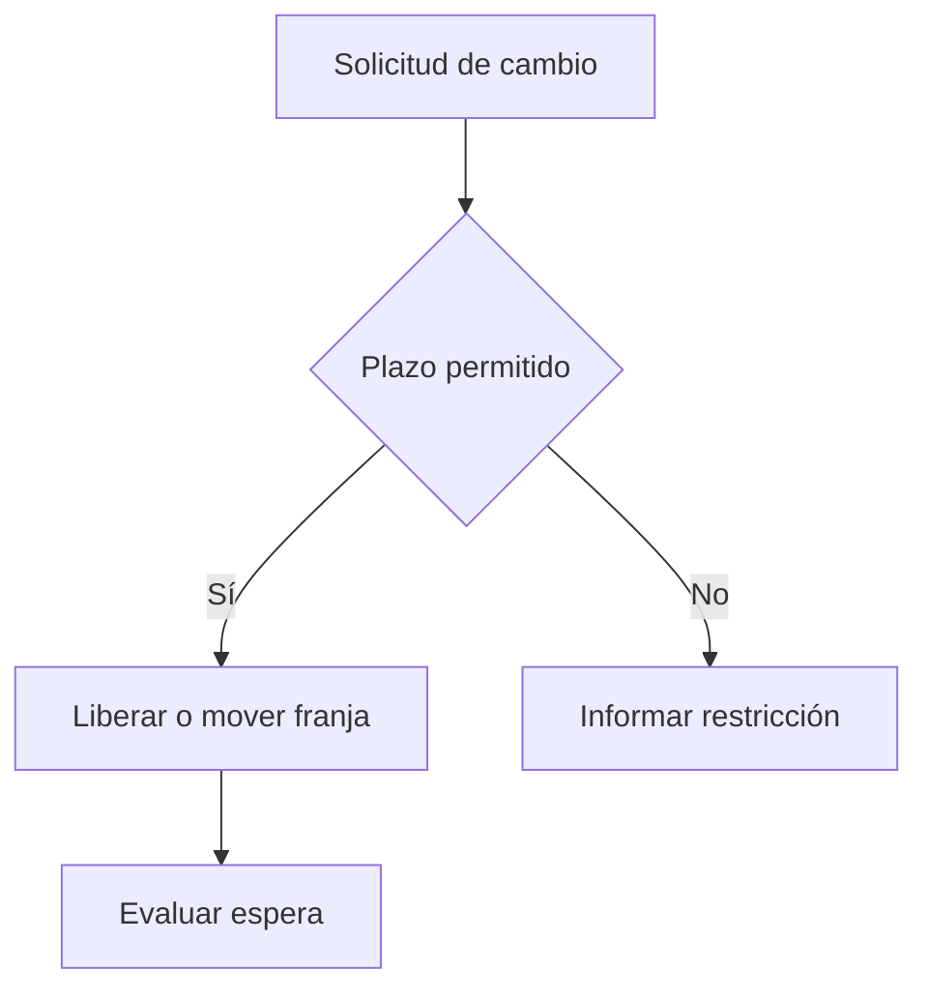
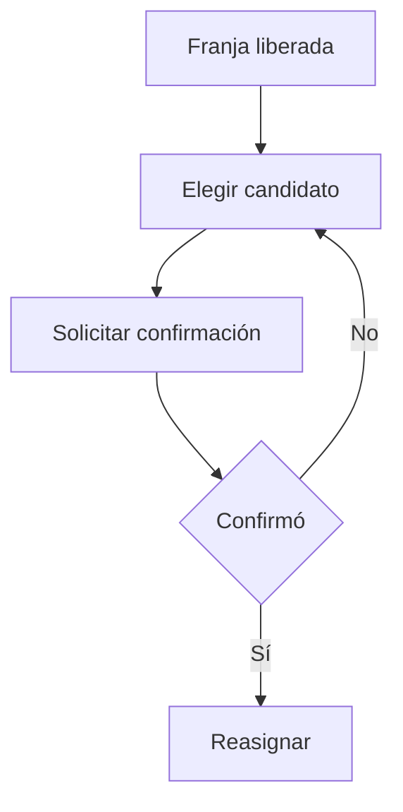

# Business Processes
| Campo | Valor |
| --- | --- |
| Versión | 0.1 |
| Estado | Draft |
| Propietario | Product Owner |
| Clasificación | Internal |
| Confidencialidad | Uso interno del proyecto |
| Revisores | Product Owner, Architecture Review |
| Aprobadores | Product Owner, Architecture Review Board |
| Última actualización | 2026-07-25 |
| Próxima revisión | Tras entrevistas |

## Proceso TO-BE: crear reserva
Disparador: cliente o personal solicita una franja. Se identifica Organización y Sucursal, se valida Servicio, Disponibilidad y conflicto; se registra la Reserva y se notifica. Reglas: BR-001, BR-002, BR-003, BR-004, BR-005, BR-010.

## Proceso TO-BE: cancelar o reprogramar
Disparador: cliente o personal solicita cambio. Se valida plazo, se libera la franja y se evalúa lista de espera; una reprogramación repite la validación de reserva. Reglas: BR-003, BR-004, BR-006, BR-007, BR-008.

## Proceso TO-BE: lista de espera
Disparador: se libera una franja o no hay disponibilidad. Se prioriza candidato elegible, se solicita confirmación y solo entonces se reasigna. Reglas: BR-008, BR-009, BR-010.

